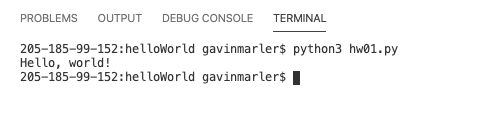

# helloWorld
## Overview
This program ouputs the words "_Hello World_". It is a basic program written in Python. 
## Development Environment
* VS Code
* Python 3.8.5

## Execution
To run put: 
```python
python3 hw01.py
``` 
The ouput is like this: 


## Useful Websites

*[Here](https://docs.python.org/3.8/) is the Python reference.